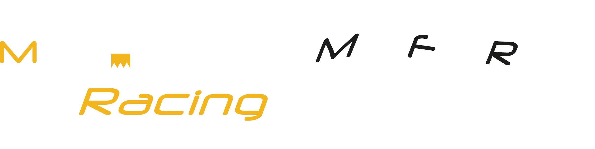

# Mainfranken Racing e.V.  

## Who we are
 
Our club was founded in 2006 by several motor sports enthusiastic students. One year later, the first vehicle was completed. Since then, every year we build a functional race car and participate in international competitions. In the 15 years that our club has existed, we have implemented many changes and innovations. For example, we competed with a gasoline engine for the first 11 seasons and then decided to switch to the pioneering electric version. This season we made the switch to build a race car that drives autonomously. 

## Our Motivation
 Establish diverse and valuable contacts with industry. (internships, diploma thesis, career entry) 

 Interesting and practical study work with prototype construction.

 Training in the ability to work in a team, structured working methods, project work. 

 Apply theoretical lecture content directly.

 Work processes of a company are recreated. 

## Formula Student

## Disciplines
