> ⚠️ **Attention**
>
> The Driverless Documentation is available here: https://mfr-driverless.github.io/documentation/
> 
> The Project Management is on plane.so: https://app.plane.so/mfr-driverless/projects/

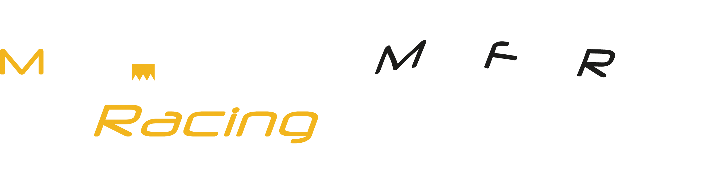

# Mainfranken Racing e.V.  
<table border="0"><tr>
    <td> 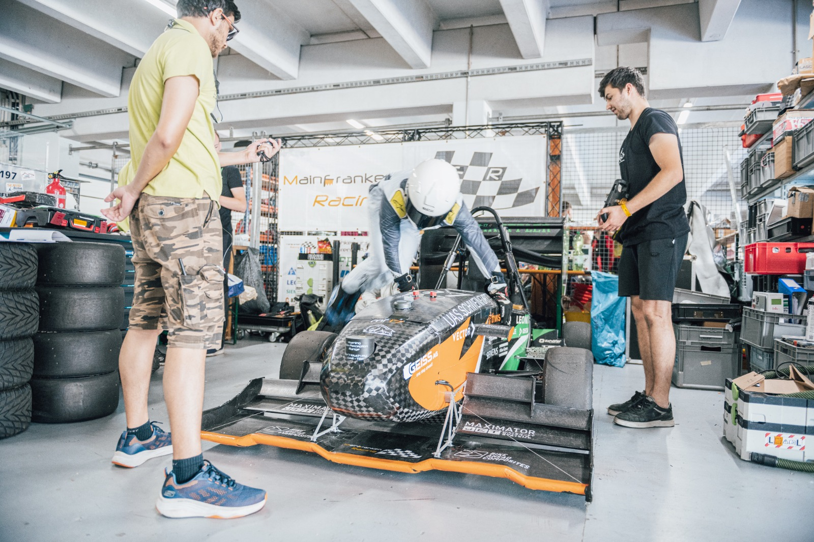 </td>
    <td> 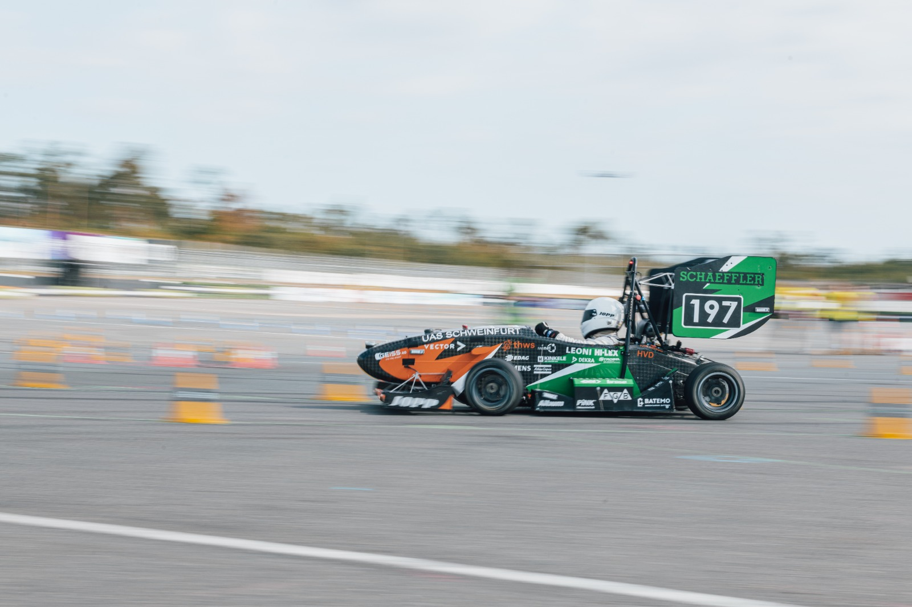 </td>
 </tr></table>
    

## Who we are
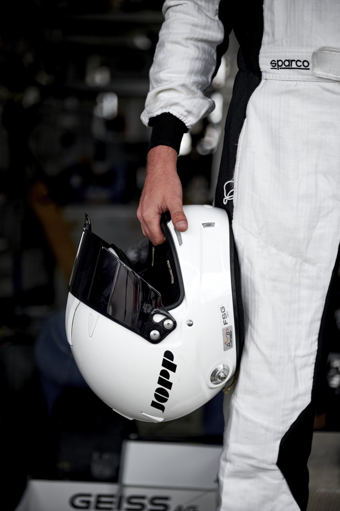   
Our club was founded in 2006 by several motor sports enthusiastic students. One year later, the first vehicle was completed. Since then, every year we build a functional race car and participate in international competitions. 
In the 15 years that our club has existed, we have implemented many changes and innovations. For example, we competed with a gasoline engine for the first 11 seasons and then decided to switch to the pioneering electric version. 
Since the 14th season, we have been developing our autonomous system, with the MF16 being the first driverless car from our team to drive at an event.    

### Our Motivation
 Establish diverse and valuable contacts with industry. (internships, diploma thesis, career entry) 

 Interesting and practical study work with prototype construction.

 Training in the ability to work in a team, structured working methods, project work. 

 Apply theoretical lecture content directly.

 Work processes of a company are recreated. 

## Formula Student
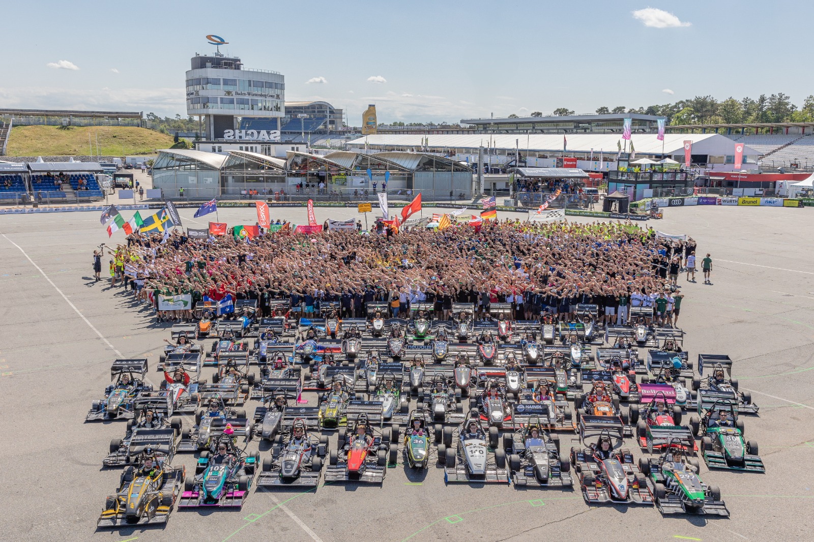 
Formula Student is a design competition in which students compete with a formula racing car they have designed and built themselves. They follow a common set of rules for the design, which are published annually by the Society of Automotive Engineers. The first Formula Student competition was held in Michigan in 1981. In Germany, Formula Student has been organized every year since 2006 by the VDI - Association of German Engineers and takes place at the Hockenheimring. The team with the best overall package of design, performance, finances, and sales arguments wins. At events, teams present their work to experts from motorsport, automotive, and supplier industries, with over 500 teams competing worldwide.

 

### Driverless
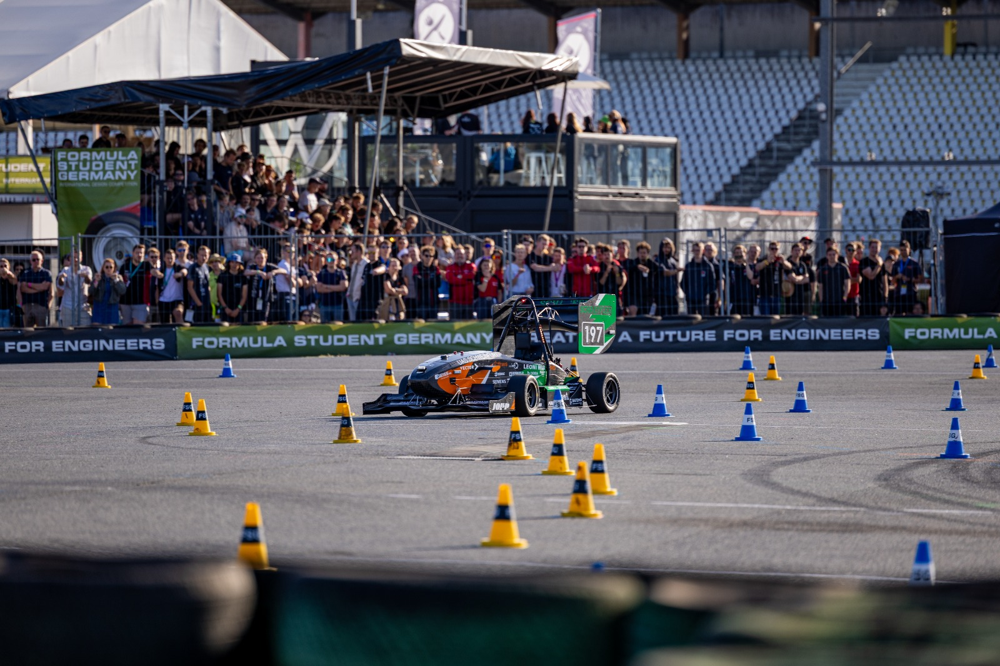
The Driverless (DV) category in Formula Student focuses on autonomous race cars that can complete all disciplines without a driver. At Mainfranken Racing e.V., this is achieved through the development of advanced sensor systems, precise actuators, and intelligent software. Together, these components enable the car to perceive its environment, plan its path and navigate the track fully autonomously.

 

### Our Results
<table border="0" width="270">
    <tr>
        <th> MF16 </th> 
        <th> MF17 </th>
        <th> MF18 </th></tr>
    <tr> 
        <td> 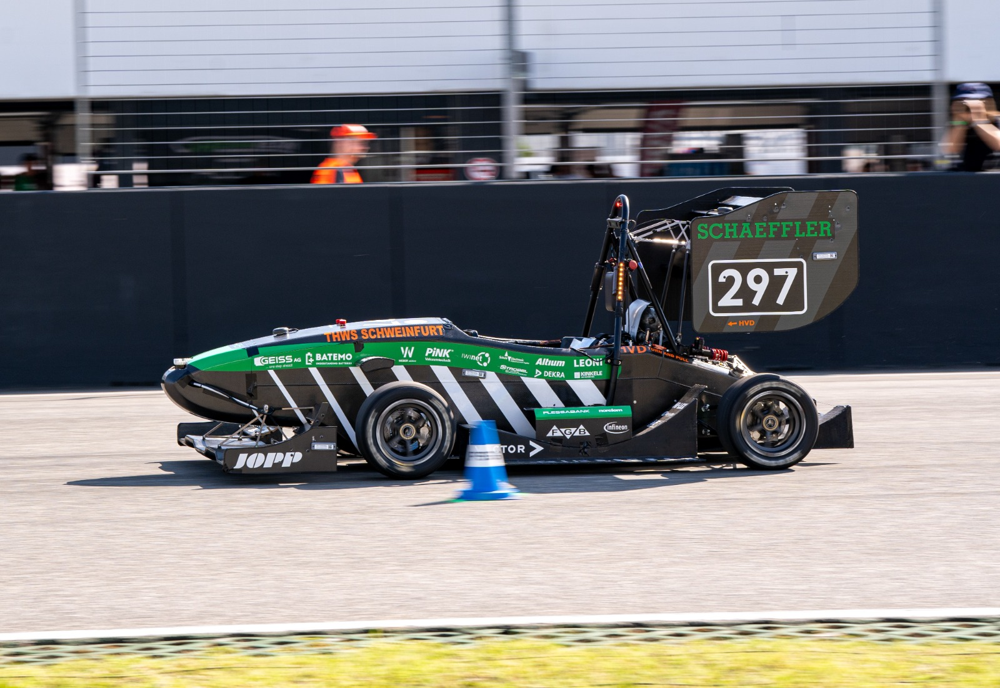 </td>
        <td> 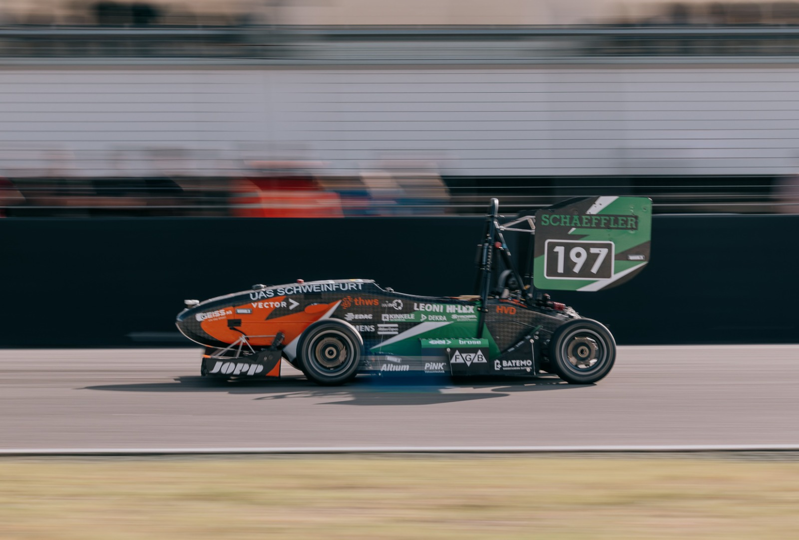 </td> 
        <td>  </td> 
    </tr>
    <tr> 
        <td width="300"> FSCzech 3th DV Overall    FSG 12th DV Overall </td>
        <td width="300"> FSCzech 7th DV Overall   FSG 12th DV Overall    FSItaly 1st DV Overall </td>
        <td width="300"> In Progress ... </td> 
    </tr>
</table>

### Driverless Disciplines
<table border="0" width="270">
    <tr>
        <th> Acceleration </th> 
        <th> Skid Pad </th>
        <th> Autocross & Trackdrive </th></tr>
    <tr> 
        <td> 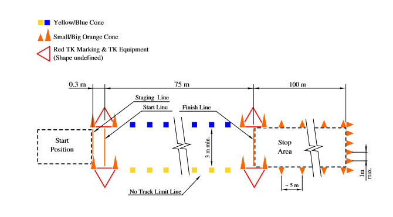 </td>
        <td> 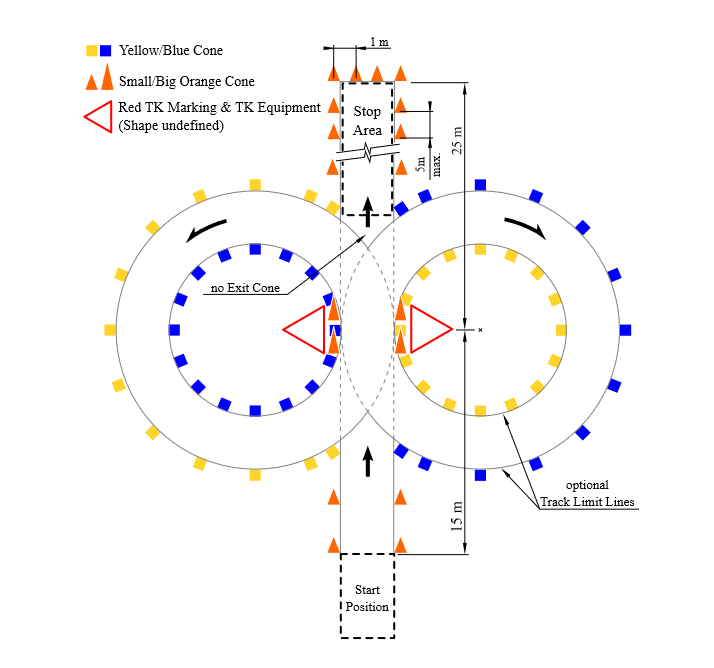 </td>
        <td> 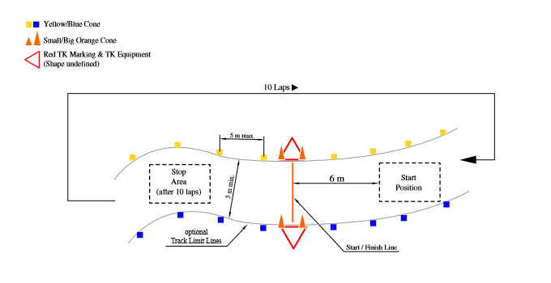 </td> 
    </tr>
    <tr> 
        <td width="300"> The acceleration of the vehicle is measured on a 75-meter-long straight. </td>
        <td width="300"> The racing cars drives through a course    bordered by pylons in the form of an eight. Two laps are driven, in the second the time is measured. </td>
        <td width="300"> The autocross and trackdrive disciplines use the same track.    <b>Trackdrive:</b> The racing car drives through the same, unknown track several times/ 10 laps.   <b>Autocross:</b> The vehicle drives through an approx. 1 kilometer long track with straights, curves and chicanes. The aim is to achieve a fast lap time. Exceeding the track boundary (= knocking over a pylon) is also penalized here with a time penalty. </td> </tr>
</table>

### Scoring Driverless - Cup
<table  border="0" align="center">
    <th> Dynamic Events:</th>
    <th> Static Events:</th>
 <tr>
 <td><table border="0"><tr> <td> Acceleration: </td> <td>75 points</td> </tr><tr> <td>Skid Pad: </td> <td>75 points</td> </tr><tr><td>Autocross: </td> <td>100 points</td> </tr><tr> <td>Trackdrive: </td> <td>200 points</td> </tr><tr><td>Efficiency: </td> <td>75 points</td> </tr></table> </td>
 <td>
 <table border="0"> <tr> <td>Business Plan Presentation: </td> <td> 75 points</td> </tr><tr> <td>Cost and Manufactoring: </td> <td> 100 points</td> </tr> <tr> <td>Engineering Design: </td> <td> 300 points</td> </tr> <table/></td></tr></table>  </table>
 
 
 Overall: 1000 points 

 
## Social Media

To stay up to date follow us on our social media channels.
  

 
 
                     
                     
    
    
    

  

<table border="0"><tr>
    <td> 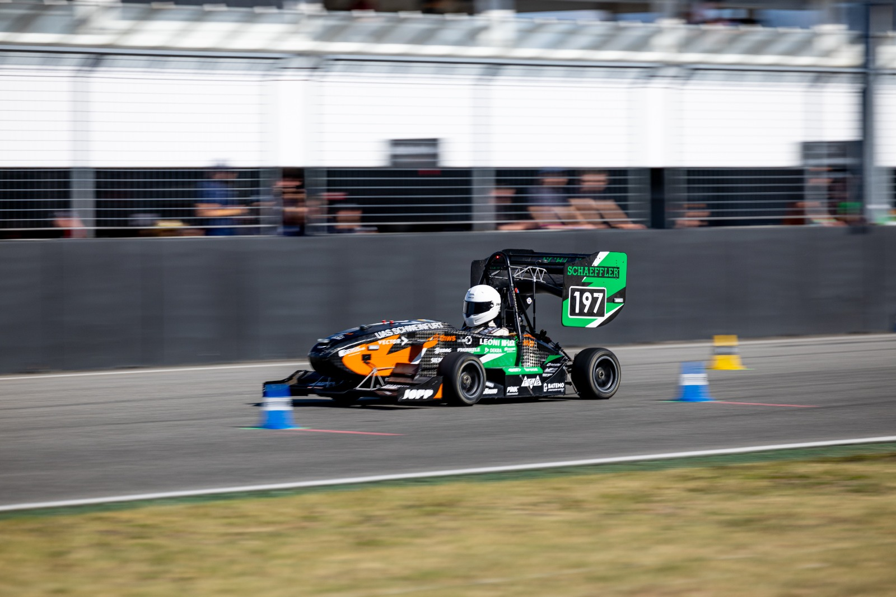 </td>
    <td> 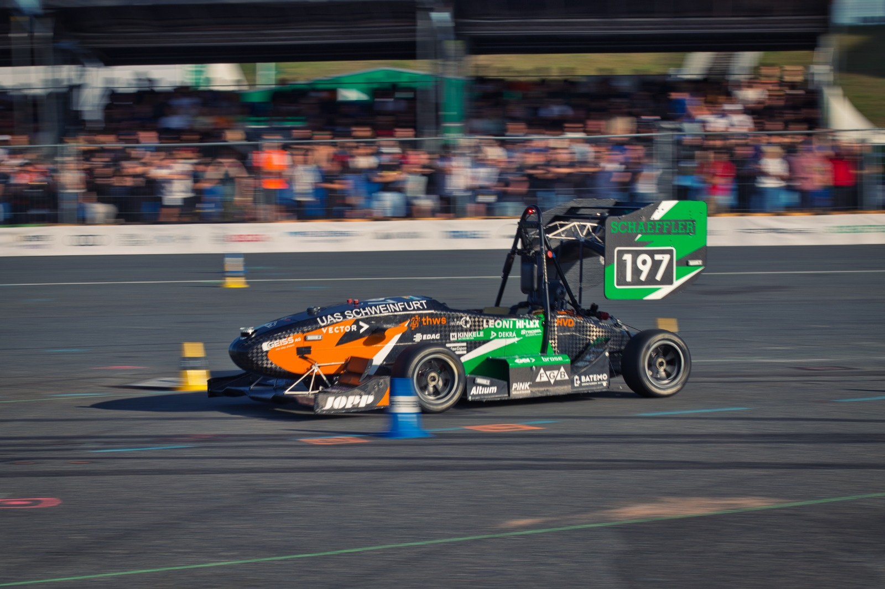 </td>
 </tr></table>
 
##

  <i> 2022 Mainfranken-Racing. Alle Rechte vorbehalten. </i> 

 
    
